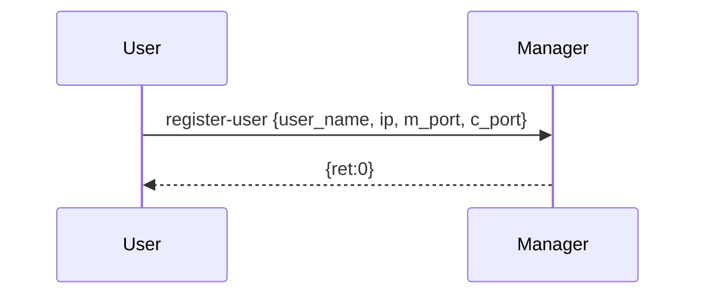
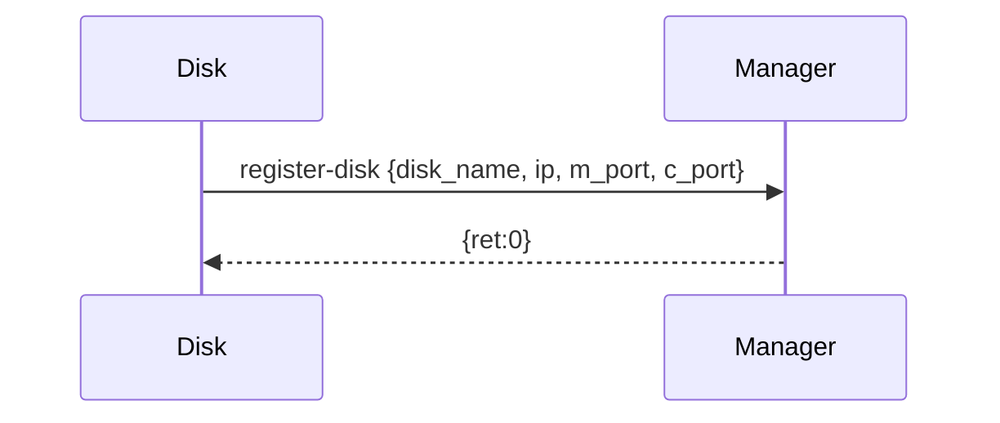
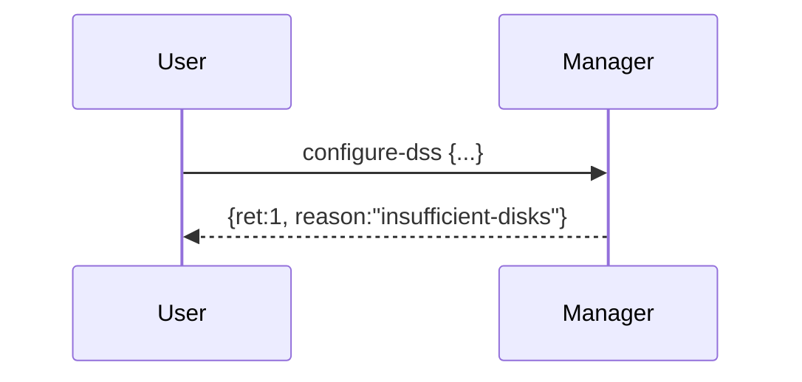
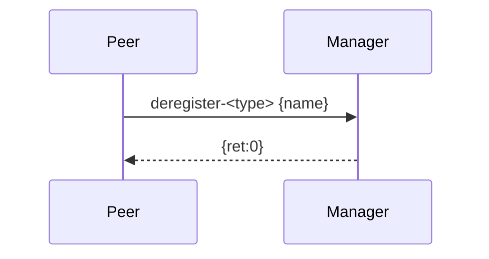

# DSS Socket Project — Milestone Design Document

> CSE 434 — Fall 2025 — Milestone scope: `register-user`, `register-disk`, `configure-dss`, `deregister-user`, `deregister-disk`.

## 1. Architecture Overview (Milestone)
- **Manager (UDP, single-threaded):** central registry for users/disks and DSS configuration.
- **Peer (User, Disk; UDP, multi-threaded skeleton):** each process maintains **m-port** and **c-port** listeners on separate threads.

## 2. Message Formats (JSON over UDP)
### 2.1 Common fields
```json
{
  "command": "<command>",
  "txid": "<uuid-v4>",
  "from": {"name":"<peer-name>", "ip":"<ipv4>", "m_port":1234, "c_port":2345},
  "payload": { ... }
}
```
### 2.2 Responses
```json
{
  "txid": "<same-as-request>",
  "ret": 0 | 1,
  "reason": "duplicate-name|port-conflict|invalid-params|insufficient-disks|dss-exists|not-found|disk-in-dss",
  "data": { ... }
}
```

### 2.3 Command payloads (Milestone)
- `register-user` → `{"user_name","ip","m_port","c_port"}`  
- `register-disk` → `{"disk_name","ip","m_port","c_port"}`  
- `configure-dss` → `{"dss_name","n","striping_unit"}`  
- `deregister-user` → `{"user_name"}`  
- `deregister-disk` → `{"disk_name"}`  

## 3. Protocols (Sequence Diagrams — Mermaid)
### 3.1 register-user (SUCCESS)

### 3.2 register-disk (SUCCESS)

### 3.3 configure-dss (SUCCESS)
```mermaid
sequenceDiagram
    participant U as User
    participant M as Manager
    U->>M: configure-dss {dss_name, n>=3, striping_unit=power-of-two[128..1MB]}
    M->>M: check Free disks >= n; no dss-name conflict
    M-->>U: {ret:0, data:{dss_name, n, striping_unit, disks:[{disk_name,ip,c_port},...]}}
```
### 3.4 configure-dss (FAILURE: insufficient disks)

### 3.5 deregister-user / deregister-disk


## 4. State & Data Structures
- `users[name] = {ip, m_port, c_port}`
- `disks[name] = {ip, m_port, c_port, state: "Free"|"InDSS", dss: null|name, striping_unit: null|int}`
- `dsss[name]  = {n, striping_unit, disks:[disk_name0..n-1]}`
- Global uniqueness for (ip,m_port) and (ip,c_port).

## 5. Validation Rules
- `register-*`: unique name; ports not in use.
- `configure-dss`:
  - `n >= 3`
  - `striping_unit` is power-of-two and in `[128, 1MiB]`
  - enough `Free` disks (`>= n`)
  - `dss_name` not already configured
  - Randomly select n Free disks and order is fixed (part of config).

## 6. Design Decisions
- JSON-over-UDP; labeled logs; Manager single-threaded; Peer dual listeners; short error reasons.

## 7. Demo Plan
- ≥2 hosts; windows: 1x manager, 3x disks, 2x users.
- Flow: start manager → register 3 disks & 2 users → U1 config SUCCESS → U2 config FAIL → deregister → stop.

## 8. Git Evidence (Screenshots to include)
- `git log --pretty=format:"%h - %an, %ad (Commit) - %cd (Author)"`
- GitHub commit history page
- `git reflog`
- `git fsck`

